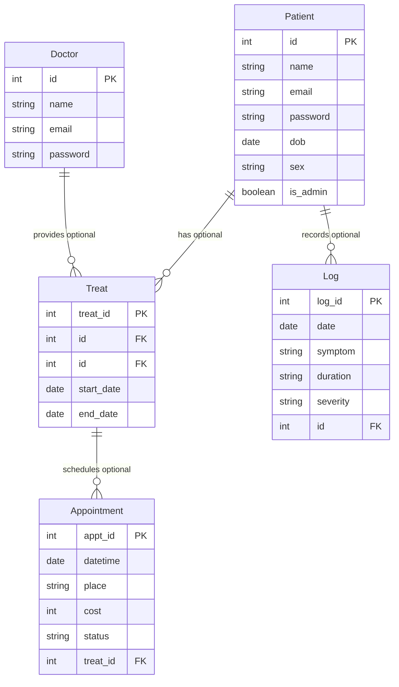

# Title

Joel von Treifeldt
Student no. 15517

# doctor and patient emails must be unique within one type of model, but a doctor can duplicate themselves as a patient with the same email no worries. BUT! that will cause confusion with logging in. how do you know what someone is trying to log in as? use roles?

Note:

- All links to online material should have corresponding screenshots included in submission.
- i.e. make sure Trello link is public! etc! and make heaps of screenshots, starting early on

Table of Contents

- [Title](#title)
- [doctor and patient emails must be unique within one type of model, but a doctor can duplicate themselves as a patient with the same email no worries. BUT! that will cause confusion with logging in. how do you know what someone is trying to log in as? use roles?](#doctor-and-patient-emails-must-be-unique-within-one-type-of-model-but-a-doctor-can-duplicate-themselves-as-a-patient-with-the-same-email-no-worries-but-that-will-cause-confusion-with-logging-in-how-do-you-know-what-someone-is-trying-to-log-in-as-use-roles)
    - [R0 - Setup](#r0---setup)
    - [R1 - Explain the problem that this app will solve, and explain how this app solves or addresses the problem.](#r1---explain-the-problem-that-this-app-will-solve-and-explain-how-this-app-solves-or-addresses-the-problem)
    - [R2 - Describe the way tasks are allocated and tracked in your project.](#r2---describe-the-way-tasks-are-allocated-and-tracked-in-your-project)
      - [Trello Board Screenshots](#trello-board-screenshots)
      - [GitHub Commit Screenshots](#github-commit-screenshots)
    - [R3 - List and explain the third-party services, packages and dependencies used in this app.](#r3---list-and-explain-the-third-party-services-packages-and-dependencies-used-in-this-app)
    - [R4 - Explain the benefits and drawbacks of this app’s underlying database system.](#r4---explain-the-benefits-and-drawbacks-of-this-apps-underlying-database-system)
    - [R5 - Explain the features, purpose and functionalities of the object-relational mapping system (ORM) used in this app.](#r5---explain-the-features-purpose-and-functionalities-of-the-object-relational-mapping-system-orm-used-in-this-app)
    - [R6 - Design an entity relationship diagram (ERD) for this app’s database, and explain how the relations between the diagrammed models will aid the database design. This should focus on the database design BEFORE coding has begun, eg. during the project planning or design phase.](#r6---design-an-entity-relationship-diagram-erd-for-this-apps-database-and-explain-how-the-relations-between-the-diagrammed-models-will-aid-the-database-design-this-should-focus-on-the-database-design-before-coding-has-begun-eg-during-the-project-planning-or-design-phase)
    - [R7 - Explain the implemented models and their relationships, including how the relationships aid the database implementation. This should focus on the database implementation AFTER coding has begun, eg. during the project development phase.](#r7---explain-the-implemented-models-and-their-relationships-including-how-the-relationships-aid-the-database-implementation-this-should-focus-on-the-database-implementation-after-coding-has-begun-eg-during-the-project-development-phase)
      - [Patient model](#patient-model)
      - [Doctor model](#doctor-model)
      - [Treatment model (join table)](#treatment-model-join-table)
      - [Appointment model](#appointment-model)
      - [Log model](#log-model)
      - [Relationships: move R6 answers here](#relationships-move-r6-answers-here)
    - [R8 - Explain how to use this application’s API endpoints.](#r8---explain-how-to-use-this-applications-api-endpoints)
      - [TALK ABOUT RESTful AND HOW I MOVED some ROUTES TO BE UNDER OTHER resources... like patients/x/treatments/ etc, while general treatment stuff is still under /treatments/... mention nested resources](#talk-about-restful-and-how-i-moved-some-routes-to-be-under-other-resources-like-patientsxtreatments-etc-while-general-treatment-stuff-is-still-under-treatments-mention-nested-resources)
      - [header data = auth / bearer token?](#header-data--auth--bearer-token)
      - [patient\_controller.py](#patient_controllerpy)
        - [Example JSON response (regenerate this? it's out of date)](#example-json-response-regenerate-this-its-out-of-date)
- [Design Requirements](#design-requirements)
- [Code Requirements](#code-requirements)
- [Coding requirements](#coding-requirements)
- [.](#)
- [.](#-1)
- [.](#-2)
- [.](#-3)

### R0 - Setup

- need to write about creating `medical` database manually in psql?
  - creating tables?
  - users?
  - granting permissions?
- activate venv

```sh
pip install -r requirements.txt
```

- run `flask run` or `flask run --debug` to run server
- PS: all passwords in this project are set to "password" for development purposes.

### R1 - Explain the problem that this app will solve, and explain how this app solves or addresses the problem.

<!-- CMP1001-6.2: JUSTIFIES the purpose and goal of the developed application.
6 to >5 pts HD
Provides a DETAILED explanation about the problem being solved by the developed application AND about how the app addresses the problem, and DOES use any objective references or statistics to support their answer. -->

Medical tracker / planner? smooth and user-friendly interface between patients and doctors

hopefully an improvement on My Health Record, the Australian ... with a focus on helping the patient / giving them more agency

By tracking patients, doctors, treatment relationships, appointments, and patient logs,

Things to add in future versions:

- Medications
- Past medications
- Diagnoses

### R2 - Describe the way tasks are allocated and tracked in your project.

<!-- CMP1001-2.3: DESCRIBES the way tasks are planned and tracked in the project.

4 to >2.99 pts P
Provides a BRIEF description about how tasks are planned and tracked in the project.

5 to >4.5 pts D
Meets P, and includes reference to and proof of THOROUGH usage of specific task management tools.

6 to >5 pts HD
Meets D, and includes proof of THOROUGH usage of specific task management tools THROUGH THE LENGTH OF THE PROJECT. -->

Trello Kanban, GitHub source control

Link to public Trello board: https://trello.com/b/zxqDWRsS/t2a2-api-webserver

Link to public GitHub repository: https://github.com/jevontrei/JoelvonTreifeldt_T2A2

#### Trello Board Screenshots

...

#### GitHub Commit Screenshots

...

### R3 - List and explain the third-party services, packages and dependencies used in this app.

<!-- CMP1001-1.2: DESCRIBES the third party services, packages or dependencies that are used in the developed application.
6 to >5 pts HD
The description provided is DETAILED, and the description details ALL of the services, packages or dependencies that are used in the developed application. -->

- Imports
  - flask: micro web framework for
  - flask_sqlalchemy: ORM for
  - Psycopg2: driver for
  - flask_marshmallow: library for serialising and deserialising ...
  - flask_jwt_extended:
  - JWT Manager?
  - flask_bcrypt:
  - python-dotenv: for loading environment variables into the Flask app
  - datetime:
- Insomnia: API client for
- PostgreSQL: DBMS for
-

### R4 - Explain the benefits and drawbacks of this app’s underlying database system.

<!-- CMP1001-2.4: IDENTIFY AND DESCRIBE the benefits and drawbacks of a chosen database system.

5 to >4.5 pts D
Identifies an appropriate database system and DESCRIBES SOME benefits and/or drawbacks to a THOROUGH level of detail.

6 to >5 pts HD
Meets D, and describes benefits AND drawbacks to a thorough level of detail. -->

The DBMS PostgreSQL was chosen primarily because it is based on the relational model. A relational database is appropriate for this medical tracker app which has multiple entities related in definitive ways. Many-to-many and one-to-many relationships are effectively handled by PostgreSQL, which is also ACID-compliant (ref). Atomicity, consistency, integrity, durability?

For this project in particular, PostgreSQL ...

https://docs.digitalocean.com/glossary/acid/

### R5 - Explain the features, purpose and functionalities of the object-relational mapping system (ORM) used in this app.

<!-- CMP1001-1.3: EXPLAINS the features and functionalities of an object-relational mapping (ORM) system
6 to >5 pts HD
Explains MULTIPLE features or functionalities of an ORM to a THOROUGH level of detail, supporting the explanation with AT LEAST ONE code example. -->

SQLAlchemy

### R6 - Design an entity relationship diagram (ERD) for this app’s database, and explain how the relations between the diagrammed models will aid the database design. This should focus on the database design BEFORE coding has begun, eg. during the project planning or design phase.

<!-- 12 points! -->

<!-- PMG1003-2.1, PMG1003-7.3: EXPLAINS a plan for normalised database relations.

9 to >8 pts C
Provides a BASIC entity relationship diagram (ERD), with a BRIEF explanation of how ALL of the relations depicted in the ERD are normalised.

10 to >9 pts D
Meets CR, and the ERD includes a legend/key of the notation and styles matching a notation or style identified in the accompanying explanation.

12 to >10 pts HD
Meets D, and the explanation includes comparisons to how AT LEAST ONE model or relations would look in other levels of normalisation than the one shown in the ERD. -->

**_BEFORE CODING begins_**

**_PLAN_** for normalised data/relations!!!!!!

The relations are as follows:

- Patient-Doctor (many to many) via the Treatments join table.
  - Implemented as Patient-Treatment (one-mandatory to many-optional) and Doctor-Treatment (one-mandatory to many-optional).
- Patient-Log (one-mandatory to many-optional)
- Treatment-Appointment (one-mandatory to many-optional)

<!-- redo and replace this whole diagram, it's out of date -->



### R7 - Explain the implemented models and their relationships, including how the relationships aid the database implementation. This should focus on the database implementation AFTER coding has begun, eg. during the project development phase.

<!-- CMP1001-7.2: DESCRIBES the project’s models in terms of the relationships they have with each other.

4 to >2.99 pts P
Provides a BRIEF description about the project’s models and their relationships, with MINIMAL information about the types of relationships that the models have.

4.5 to >4 pts C
Meets P, and includes BRIEF information about how the relationships of the models interact with other models.

5 to >4.5 pts D
Meets CR, and includes information about the queries that could be used to access data using the models’ relationships.

6 to >5 pts HD
Meets D, and includes appropriate code examples supporting the descriptions. -->

**AFTER CODING begins**

#### Patient model

Patients ...

<!-- UPDATE THIS CODE: -->
```py
class Patient(db.Model):
    __tablename__ = "patients"

    id = db.Column(db.Integer, primary_key=True)
    name = db.Column(db.String(100), nullable=False)
    email = db.Column(db.String(100), nullable=False, unique=True)
    password = db.Column(db.String, nullable=False)
    dob = db.Column(db.Date, nullable=False)
    sex = db.Column(db.String(15))
    is_admin = db.Column(db.Boolean, default=False)

    logs = db.relationship(
        "Log", back_populates="patient", cascade="all, delete")

    # one-to-many
    # check if this makes sense as cascade?! i think it does bc this is the parent?
    treatments = db.relationship(
        "Treatment", back_populates="patient", cascade="all, delete")
```

should i include schemas here?

#### Doctor model

Doctors ...

```py
.
```

#### Treatment model (join table)

    # This relationship allows us to view a treatment's appts... bi-directionally but no need for a line starting with appt_id = ... bc it's not actually a column in the treatments table, and bc treatments is the parent. this is just to establish the two-way connection


Treatments were initially represented using `db.Table()` with FK attributes only. However, to facilitate the inclusion of other attributes (start date, end date), it was converted to a full entity using `db.model()` along with a schema.

```py
.
```

#### Appointment model

deleting a treatment cascade-deletes all child appointments. This is not recommended, and an admin

Appointments ...

```py
.
```

#### Log model

Logs ...

```py
.
```

#### Relationships: move R6 answers here

The relationships ...

`db.relationship()`

`back_populates`

`cascade`

### R8 - Explain how to use this application’s API endpoints.

#### TALK ABOUT RESTful AND HOW I MOVED some ROUTES TO BE UNDER OTHER resources... like patients/x/treatments/ etc, while general treatment stuff is still under /treatments/... mention nested resources

Each endpoint should be explained, including the following data for each endpoint:

- HTTP verb
- Path or route
- Any required body or header data
- Response / Expected response data
- Authentication methods where applicable
  - jwt_required()

ALSO different authorisation levels:

- Authorisation:
  - authorise_as_admin
  - authorise_as_log_viewer
  - authorise_as_log_owner
  - authorise_treatment_participant
- Validation / sanitisation of input
  - regex? no --> fields.Email() or whatever

#### header data = auth / bearer token?

<!-- CMP1001-1.4: IDENTIFY AND DESCRIBE the application’s API endpoints.

4 to >2.99 pts P
Identifies MOST of the application’s API endpoints, including (for each identified endpoint) the HTTP verb, route path, and any required body or header data.

5 to >4.5 pts D
Meets P, and includes examples of what each identified endpoint will return on success AND failure of that endpoint operation.

6 to >5 pts HD
Meets D, applied to ALL of the application’s API endpoints. -->

All endpoints are described below, with routes, verbs, required body/header data, and responses as applicable.

#### patient_controller.py

Route: `http://localhost:5000/patients/`

- HTTP verb: `GET`
- Required body data: N/A
- Required header data: ?
- Response: should include... JSON? SHOW EXAMPLE? HTTP STATUS CODE 200? Will respond with 404 Not Found if patient ID does not exist

##### Example JSON response (regenerate this? it's out of date)

HTTP status code: 200 OK

```
[
  {
    "appt_id": 1,
    "cost": 100,
    "datetime": "2000-12-12T00:00:00",
    "notes": null,
    "place": "Frog's Hollow Medical Centre",
    "status": "Completed",
    "treatment_id": 1
  },
  {
    "appt_id": 2,
    "cost": 206,
    "datetime": "1999-06-13T00:00:00",
    "notes": null,
    "place": "Spring Hill Medical Centre",
    "status": "Completed",
    "treatment_id": 1
  },
  {
    "appt_id": 3,
    "cost": 99,
    "datetime": "1989-06-13T00:00:00",
    "notes": "general checkup",
    "place": "Spring Hill Medical Centre",
    "status": "Cancelled",
    "treatment_id": 1
  },
  {
    "appt_id": 4,
    "cost": 58,
    "datetime": "2024-12-01T00:00:00",
    "notes": null,
    "place": "UQ Medical Centre",
    "status": "Scheduled",
    "treatment_id": 2
  },
  {
    "appt_id": 5,
    "cost": 52,
    "datetime": "2025-06-08T00:00:00",
    "notes": "yearly mental health appt",
    "place": "UQ Medical Centre",
    "status": "Scheduled",
    "treatment_id": 3
  },
  {
    "appt_id": 6,
    "cost": 77,
    "datetime": "2023-10-01T00:00:00",
    "notes": null,
    "place": "UQ Medical Centre",
    "status": "Completed",
    "treatment_id": 2
  },
  {
    "appt_id": 7,
    "cost": 32,
    "datetime": "1463-09-02T00:00:00",
    "notes": "blood test",
    "place": "London Medical Centre",
    "status": "Completed",
    "treatment_id": 3
  },
  {
    "appt_id": 8,
    "cost": 21,
    "datetime": "1463-09-11T00:00:00",
    "notes": "follow-up for blood test",
    "place": "London Medical Centre",
    "status": "Completed",
    "treatment_id": 3
  }
]
```

Route: `http://localhost:5000/patients/<int:id>`

- HTTP verb: `GET`
- Body/header data: ?
- Response: JSON? SHOW EXAMPLE? HTTP STATUS CODE? 200/404?

Route: `http://localhost:5000/patients/`

- HTTP verb: `POST`
- Body/header data: ?
- Response: JSON? SHOW EXAMPLE? HTTP STATUS CODE? 200/404?

---

# Design Requirements

- The web server must:
- function as intended
- store data in a persistent data storage medium (eg. a relational database)
- appropriately validate & sanitise any data it interacts with
- use appropriate HTTP web request verbs - following REST conventions - for various types of data manipulation
- cover the full range of CRUD functionality for data within the database
- The database manipulated by the web server must accurately reflect the entity relationship diagram created for the Documentation Requirements.
- The database tables or documents must be normalised
- API endpoints must be documented in your readme
- Endpoint documentation should include
- HTTP request verbs
- Required data where applicable
- Expected response data
- Authentication methods where applicable

# Code Requirements

- The web server must:
- use appropriate functionalities or libraries from the relevant programming language in its construction
- use appropriate model methods to query the database
- catch errors and handle them gracefully
- returns appropriate error codes and messages to malformed requests
- use appropriate functions or methods to sanitise & validate data
- use D.R.Y coding principles
- All queries to the database must be commented with an explanation of how they work and the data they are intended to retrieve

# Coding requirements

<!-- PGM1003-2.2: IMPLEMENTS a normalised database design.

5 to >4.5 pts D
Implemented models each serve a single purpose, contain appropriate fields and relationships. There may be a little duplication.

6 to >5 pts HD
Meets D with no duplication and ideal model implementation. -->

# .

<!-- PGM1003-6.2: IMPLEMENTS a database design that appropriately addresses the requirements of the planned scenario.

5 to >4.5 pts D
All tables, fields, and relationships adequately represent an appropriate solution.

6 to >5 pts HD
Meets D and represents a highly optimised or normalised solution. -->

# .

<!-- PGM1003-4.1: IMPLEMENTS database queries that provide correct data for the given scenario.
6 to >5 pts HD
Implements queries that provide ALL data needed for a working solution, and the queries are suitably complex and optimised. -->

# .

<!-- PGM1003-4.2: WRITES code comments that demonstrate how the queries implemented correctly represent the database structure.
6 to >5 pts HD
ALL queries or model methods are commented to a THOROUGH level of detail, with reference to a style guide or comment style guide in the project documentation. -->

# .

<!-- PGM1003-5.2: IMPLEMENTS sanitization and validation techniques on user input to maintain data integrity
6 to >5 pts HD
Validates ALL user input AND sanitises user input where relevant. -->
