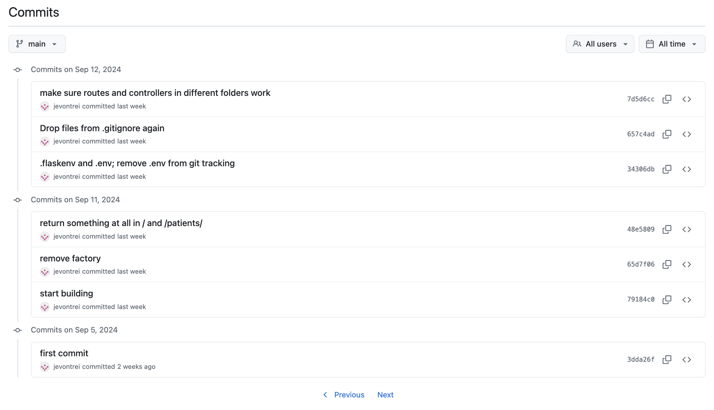
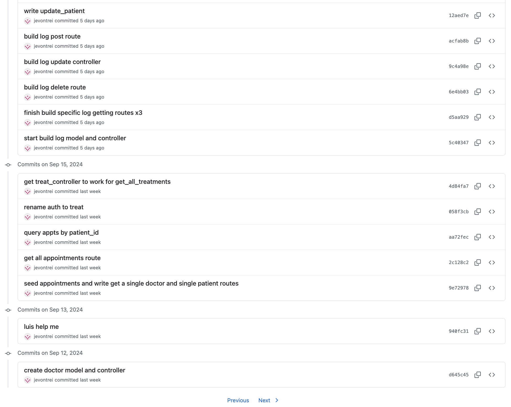
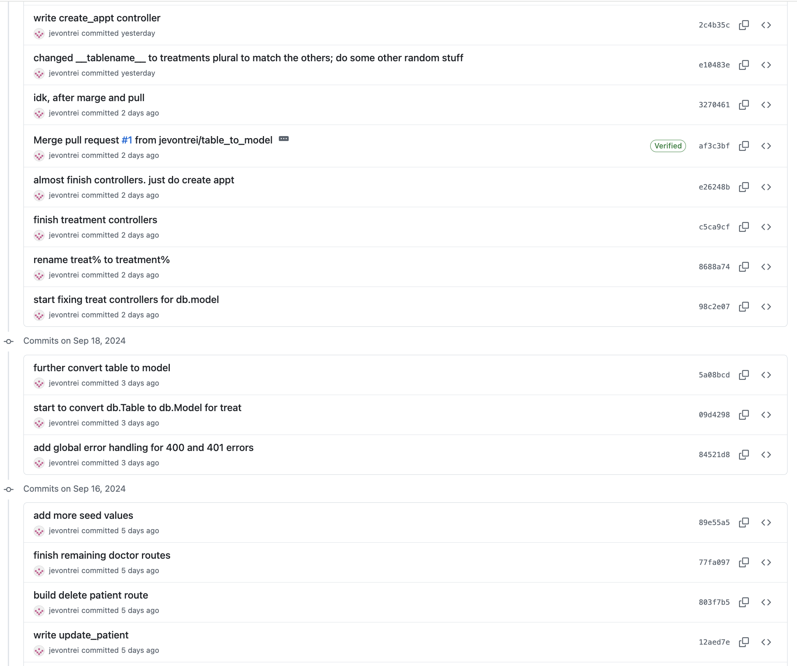
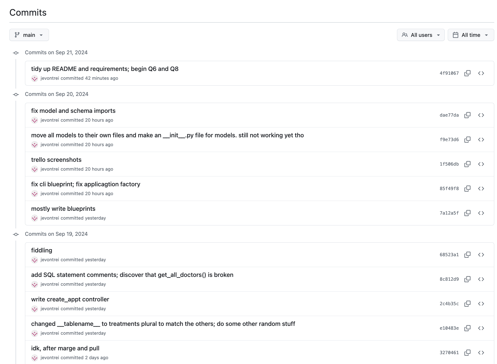
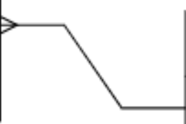

# T2A2: API Web Server

Joel von Treifeldt
Student no. 15517

## Table of Contents

- [T2A2: API Web Server](#t2a2-api-web-server)
  - [Table of Contents](#table-of-contents)
  - [Code/Comments Requirements](#codecomments-requirements)
  - [R0 - Setup](#r0---setup)
  - [R1 - Explain the problem that this app will solve, and explain how this app solves or addresses the problem.](#r1---explain-the-problem-that-this-app-will-solve-and-explain-how-this-app-solves-or-addresses-the-problem)
      - [Problem](#problem)
      - [Solution](#solution)
        - [Sources](#sources)
  - [R2 - Describe the way tasks are allocated and tracked in your project.](#r2---describe-the-way-tasks-are-allocated-and-tracked-in-your-project)
      - [Trello Board Screenshots](#trello-board-screenshots)
        - [September 5th](#september-5th)
        - [September 12th](#september-12th)
        - [September 15th](#september-15th)
        - [September 16th](#september-16th)
        - [September 19th](#september-19th)
        - [September 20th](#september-20th)
        - [September 21st](#september-21st)
        - [September 22nd](#september-22nd)
        - [September 28th](#september-28th)
        - [September 29th](#september-29th)
      - [GitHub Commit Screens](#github-commit-screens)
  - [R3 - List and explain the third-party services, packages and dependencies used in this app.](#r3---list-and-explain-the-third-party-services-packages-and-dependencies-used-in-this-app)
  - [R4 - Explain the benefits and drawbacks of this app’s underlying database system.](#r4---explain-the-benefits-and-drawbacks-of-this-apps-underlying-database-system)
      - [Advantages](#advantages)
      - [Disdvantages](#disdvantages)
      - [Source/s](#sources-1)
  - [R5 - Explain the features, purpose and functionalities of the object-relational mapping system (ORM) used in this app.](#r5---explain-the-features-purpose-and-functionalities-of-the-object-relational-mapping-system-orm-used-in-this-app)
  - [R6 - Design an entity relationship diagram (ERD) for this app’s database, and explain how the relations between the diagrammed models will aid the database design. This should focus on the database design BEFORE coding has begun, eg. during the project planning or design phase.](#r6---design-an-entity-relationship-diagram-erd-for-this-apps-database-and-explain-how-the-relations-between-the-diagrammed-models-will-aid-the-database-design-this-should-focus-on-the-database-design-before-coding-has-begun-eg-during-the-project-planning-or-design-phase)
    - [Entities](#entities)
    - [Relationships](#relationships)
    - [Alternative Normalisation](#alternative-normalisation)
    - [ERD Legend: Crow's Foot Notation](#erd-legend-crows-foot-notation)
    - [September 11th: Original ERD](#september-11th-original-erd)
  - [R7 - Explain the implemented models and their relationships, including how the relationships aid the database implementation. This should focus on the database implementation AFTER coding has begun, eg. during the project development phase.](#r7---explain-the-implemented-models-and-their-relationships-including-how-the-relationships-aid-the-database-implementation-this-should-focus-on-the-database-implementation-after-coding-has-begun-eg-during-the-project-development-phase)
      - [September 27th: Final ERD](#september-27th-final-erd)
      - [Patient model and controller](#patient-model-and-controller)
      - [Doctor model and controller](#doctor-model-and-controller)
      - [Treatment model (join table) and controller](#treatment-model-join-table-and-controller)
      - [Appointment model and controller](#appointment-model-and-controller)
      - [Log model and controller](#log-model-and-controller)
      - [Relationships: move R6 answers here](#relationships-move-r6-answers-here)
      - [utils.py](#utilspy)
  - [R8 - Explain how to use this application’s API endpoints.](#r8---explain-how-to-use-this-applications-api-endpoints)
      - [TALK ABOUT RESTful AND HOW I MOVED some ROUTES TO BE UNDER OTHER resources... like patients/x/treatments/ etc, while general treatment stuff is still under /treatments/... mention nested resources](#talk-about-restful-and-how-i-moved-some-routes-to-be-under-other-resources-like-patientsxtreatments-etc-while-general-treatment-stuff-is-still-under-treatments-mention-nested-resources)
      - [header data = auth / bearer token?](#header-data--auth--bearer-token)
      - [main.py](#mainpy)
      - [appt\_controller.py](#appt_controllerpy)
      - [auth\_controller.py](#auth_controllerpy)
      - [doctor\_controller.py](#doctor_controllerpy)
      - [patient\_controller.py](#patient_controllerpy)
      - [patient\_log\_controller.py](#patient_log_controllerpy)
      - [treatment\_controller.py](#treatment_controllerpy)

---

## Code/Comments Requirements

- Style guide: PEP-8

---

## R0 - Setup

Ensure Python 3.x is installed and in use. This project was developed with Python 3.11.7.

Create virtual environment: `python3 -m venv venv`.

Activate virtual environment: `source venv/bin/activate`.

Install dependencies: `pip install -r requirements.txt`.

Create custom environment variables for sensitive information in a `.env` file in the root directory: `DATABASE_URI` and `JWT_SECRET_KEY`.

Run `psql` and ensure that a database exists with a name that matches that mentioned in `DATABASE_URI`. Assign any necessary user privileges.

Ensure database is reset and initialised by running `flask db drop`, `flask db create` and `flask db seed`.

Run `flask run` or `flask run --debug` to run the WSGI development server.

Note: all seeded user passwords in this project are set to "password" for development purposes.

---

## R1 - Explain the problem that this app will solve, and explain how this app solves or addresses the problem.

<!-- CMP1001-6.2: JUSTIFIES the purpose and goal of the developed application.
6 to >5 pts HD
Provides a DETAILED explanation about the problem being solved by the developed application AND about how the app addresses the problem, and DOES use any objective references or statistics to support their answer. -->

#### Problem

Patients who have complex or long-term health issues may have many appointments with many health professionals over a long period of time. They may find it difficult to use their precious medical appointment time wisely, especially if financial difficulty is involved. If a patient has five years of relevant details, they may forget important details or get flustered during a short or costly appointment. It may also be difficult for the doctor to get a bird's-eye view of the whole health context, including mental health. My Health Record, the Australian digital platform for recording such details, has faced challenges and low usage due to concerns about data security, cumbersome functionality and user experience, and a lack of awareness about the program. My Health Record also lacks the functionality for patients to participate meaningfully and submit their own detailed health content to their profile. Overall, patient agency and participation could be vastly improved.

#### Solution

The current goal is to maximise patient agency with a medical tracker application. This backend project will focus on patient participation through custom content in the form of health logs. Future versions should focus heavily on information security concerns. A smooth and user-friendly interface between patients and doctors is imperative, due to the user experience issues surrounding My Health Record. Future versions should develop a minimalist and accessible front end.

This API app is a living shared document/database accessible by both patient and doctors. Patients track any and all details in a log, which authorised doctors can view at any time. Authorised doctors cannot edit the logs but can view them. Future versions should allow doctors to make log comments. By putting control in the hands of the patient, and tracking patients, doctors, treatment relationships, appointments, and patient logs, it is hoped that communication and clarity between patient and health professionals may be maximised.

Features to add in future versions:

- Medications and the prescribing doctor, including past medications
- Test results / pathology reports
- Diagnoses

##### Sources

- https://www.afr.com/policy/health-and-education/my-health-record-struggles-to-be-useful-for-patients-20221129-p5c218#:~:text=%E2%80%9COne%20of%20the%20constant%20areas,look%20up%20their%20pathology%20results.
- https://www.cremornemedical.com.au/news-articles/my-health-record-pros-and-cons/
- https://www.ncbi.nlm.nih.gov/pmc/articles/PMC9977020/

? check these:

- Mizen, R. (2022, November 29). My Health Record struggles to be useful for patients. Australian Financial Review. https://www.afr.com/policy/health-and-education/my-health-record-struggles-to-be-useful-for-patients-20221129-p5c218
- Cremorne Medical Practice. (n.d.). My Health Record: Pros and cons. https://www.cremornemedical.com.au/news-articles/my-health-record-pros-and-cons/
- Abidi, S. S. R., Abidi, S., & Abusharekh, A. (2023). The past, present and future of electronic personal health records: A perspective from Canada. International Journal of Medical Informatics, 171, 104966. https://doi.org/10.1016/j.ijmedinf.2023.104966

---

## R2 - Describe the way tasks are allocated and tracked in your project.

<!-- CMP1001-2.3: DESCRIBES the way tasks are planned and tracked in the project.

4 to >2.99 pts P
Provides a BRIEF description about how tasks are planned and tracked in the project.

5 to >4.5 pts D
Meets P, and includes reference to and proof of THOROUGH usage of specific task management tools.

6 to >5 pts HD
Meets D, and includes proof of THOROUGH usage of specific task management tools THROUGH THE LENGTH OF THE PROJECT. -->

Link to public Trello board: https://trello.com/b/zxqDWRsS/t2a2-api-webserver

Throughout this project, a Trello Kanban board was used to plan tasks and track progress. Three primary lists named "To Do", "Doing", and "Done" contain cards, each with due dates and sub-checklists. Another list shows the Documentation Requirements for ease of access. See screenshots below.

---

Link to public GitHub repository: https://github.com/jevontrei/JoelvonTreifeldt_T2A2

In addition, a GitHub remote repository was used for version history and source control. Dozens of commits were made throughout the development process, and GitHub also facilitated branching and merging/pulling of features. See screenshots below.

---

#### Trello Board Screenshots

##### September 5th


---

##### September 12th


---

##### September 15th


---

##### September 16th


---

##### September 19th


---

##### September 20th


---

##### September 21st


---

##### September 22nd


---

##### September 28th


---

##### September 29th


...

---

#### GitHub Commit Screens

these are out of order:







...

---

## R3 - List and explain the third-party services, packages and dependencies used in this app.

<!-- CMP1001-1.2: DESCRIBES the third party services, packages or dependencies that are used in the developed application.
6 to >5 pts HD
The description provided is DETAILED, and the description details ALL of the services, packages or dependencies that are used in the developed application. -->

- Flask: micro framework for web development with Python
- Flask_sqlalchemy: ORM for connecting Python to a database
- Flask_marshmallow: library for (de)serialising Python objects, JSON files etc.
- Flask_jwt_extended: for JWT functionality such as creating and fetching currently logged in user tokens
- Flask_bcrypt: for hashing passwords
- Insomnia: API client for simulating a web browser interface with control over HTTP verbs and request body content
- PostgreSQL: DBMS for managing a relational SQL database
- Psycopg2: driver/adapter for connecting Python to PostgreSQL
- Python-dotenv: for loading sensitive environment variables into the Flask app

---

## R4 - Explain the benefits and drawbacks of this app’s underlying database system.

<!-- CMP1001-2.4: IDENTIFY AND DESCRIBE the benefits and drawbacks of a chosen database system.

5 to >4.5 pts D
Identifies an appropriate database system and DESCRIBES SOME benefits and/or drawbacks to a THOROUGH level of detail.

6 to >5 pts HD
Meets D, and describes benefits AND drawbacks to a thorough level of detail. -->

#### Advantages

The DBMS PostgreSQL was chosen primarily because it is based on SQL and the relational model. A relational database is appropriate for this medical tracker app which has multiple entities related in highly specified ways. Many-to-many and one-to-many relationships are elegantly handled by PostgreSQL, which is also ACID-compliant. ACID refers to the values of atomicity (), consistency (), integrity (), and durability (). PostgreSQL is flexible and can handle very large amounts of data. Its free and open-source nature make it an accessible resource with maximised transparency, and its popularity indicates a healthy userbase and support network.

For this project in particular, PostgreSQL ...

#### Disdvantages

Compared to other alternatives such as MySQL, PostgreSQL may perform slower for certain tasks. The level of knowledge required may also present challenges in contrast to lightweight options such as SQLite.

#### Source/s

- https://docs.digitalocean.com/glossary/acid/

---

## R5 - Explain the features, purpose and functionalities of the object-relational mapping system (ORM) used in this app.

<!-- CMP1001-1.3: EXPLAINS the features and functionalities of an object-relational mapping (ORM) system

6 to >5 pts HD
Explains MULTIPLE features or functionalities of an ORM to a THOROUGH level of detail, supporting the explanation with AT LEAST ONE code example. -->

The purpose of SQLAlchemy, the chosen ORM, is to allow Python to communicate with the database. Its features include the ability to create database commands for dropping, creating and seeding tables, as well as built-in CRUD syntax for creating new entity instances, querying the database, editing content, adding content to the database session, and committing changes. SQLAlchemy efficiently allows the developer to use Pythonic syntax in place of explicit SQL statements.

The following is a code example of a model being created. This model subclasses SQLAlchemy's `db.Model` class, which is perfect for representing relational database tables. Tables attributes are created with `db.Column()`, and `db.relationship()` establishes two-way connecgtions between entities.

```py
class Patient(db.Model):
    __tablename__ = "patients"

    # Attributes/columns
    patient_id = db.Column(db.Integer, primary_key=True)
    name = db.Column(db.String(100), nullable=False)
    email = db.Column(db.String(100), nullable=False, unique=True)
    password = db.Column(db.String(100), nullable=False)
    dob = db.Column(db.Date, nullable=False)
    sex = db.Column(db.String(15))
    is_admin = db.Column(db.Boolean, default=False)

    # One-to-many relationships from the patient's (parent) perspective
    logs = db.relationship("Log", back_populates="patient", cascade="all, delete")
    treatments = db.relationship("Treatment", back_populates="patient", cascade="all, delete")
```

The following code demonstrates SQLAlchemy's querying ability using `db.select()` and `db.session()`.

```py
@patients_bp.route("/<int:patient_id>/treatments/")
@jwt_required()
@authorise_as_admin
def get_patient_treatments(patient_id):
    try:
        # Create SQLAlchemy query statement:
        # SELECT *
        # FROM treatments
        # WHERE treatments.patient_id = :patient_id_1;
        stmt = db.select(
            Treatment
        ).filter_by(
            patient_id=patient_id
        )

        # Execute statement, fetch resulting values
        treatments = db.session.scalars(stmt).fetchall()
        if not treatments:
            return jsonify(
                {"error": f"No treatments found for patient {patient_id}."}
            ), 404

        return treatments_schema.dump(treatments)

    except Exception as e:
        return jsonify(
            {"error": f"Unexpected error: {e}."}
        ), 500
```

---

## R6 - Design an entity relationship diagram (ERD) for this app’s database, and explain how the relations between the diagrammed models will aid the database design. This should focus on the database design BEFORE coding has begun, eg. during the project planning or design phase.

<!-- 12 points! -->

<!-- PMG1003-2.1, PMG1003-7.3: EXPLAINS a plan for normalised database relations.

9 to >8 pts C
Provides a BASIC entity relationship diagram (ERD), with a BRIEF explanation of how ALL of the relations depicted in the ERD are normalised.

10 to >9 pts D
Meets CR, and the ERD includes a legend/key of the notation and styles matching a notation or style identified in the accompanying explanation.

12 to >10 pts HD
Meets D, and the explanation includes comparisons to how AT LEAST ONE model or relations would look in other levels of normalisation than the one shown in the ERD. -->

Before coding began, the initial planning process involved brainstorming the main entities and relationships involved in a patient's experience with healthcare professionls.

All relations are in first normal form (1NF). The cells in all tables are atomic (they contain maximum one value), they all have unique primary keys, and there are no entirely duplicate columns or rows within a table. All relations are in second normal form (2NF). Each cell within a table depends on its PK. All relations are in third normal form (3NF). None of the non-key cells depend on each other.

The originally proposed ERD, shown below with crow's foot notation, contained the following entities and relationships.

https://www.freecodecamp.org/news/database-normalization-1nf-2nf-3nf-table-examples/

### Entities

**Patient**

- Normalisation: 3NF. Patient model contains no redundant auth details, as they are stored in a separate join table. Similarly, no log details are stored here, as they have a dedicated entity. The same applies for medications, prescriptions, doctors and appointments.

**Log**

- Normalisation: 3NF. There are no patient details in the log beyond the FK, because the FK is sufficient.

**Doctor**

- Normalisation: 3NF. No patient, auth or appointment details reside within the doctors table. These are all normalised away into their own entities.

**Auth (join table)**

- Purpose: to establish a trustworthy relationships between patient and doctor.
- Normalisation: 3NF.

**Appointment (join table)**

- Purpose: to plan and track meetings between patients and healthcare professionals, which depend on permission according to the Auth table.
- Normalisation: 3NF. Only FKs for patients and doctors are included. All other non-key attributes are purely internal and independent of each other.

**Medication**

- Normalisation: 3NF. All patient and prescription data is separately stored in their respective tables. Medication attributes (name, type) do not depend on each other.

**Prescription** (join table)

- Purpose: to plan and track the medications prescribed to specific patients by specific doctors.
- Normalisation: 3NF. Independently contains information for patients taking medication without redundancy. Only FKs, date and dosage are included.

### Relationships

- Patient-Doctor (many to many) via the Auth join table AND Appointment join table.
  - Implemented as Patient-Auth (one to many) and Doctor-Auth (one to many).
  - Implemented as Patient-Appointment (one to many) and Doctor-Appointment (one to many).
- Patient-Log (one to many)
- Patient-Medication (many to many) via the Prescription join table
  - Implemented as Patient-Prescription (one to many) and Medication-Prescription (one to many).

Note: Mandatory/optional ordinality not yet implemented, and many-to-many crow's foot notation is backwards in the ERD.

During discussion with teaching staff, it was suggested that the Appointments utilise the Auth FK instead of both Patient and Doctor FKs. This was an attempt to reduce redundancy. Appointments were kept separate from Auth, because in the real world doctor may require authorisation to view a patient's log without having had an appointment with them, e.g. if an authorised doctor is seeking a second opinion. Therefore, the Auth table is used to verify/permit any event associated with sensitive information involving a patient and/or a doctor. It was also suggested that a start date and end date be added to Auth entities, to maximise control and privacy for the patient.

### Alternative Normalisation

To compare normalisation possibilities, it is worth noting that the Patient and Doctor models share some features. This may indicate redundancy. The creation of a User class (which Patient and Doctor inherit from) would support a highly normalised and optimised dataset. Patient and Doctor share attributes such as name, email, password, sex, is_admin. These could more efficiently be defined in and inherited from a parent User class, as follows:

- User(user_id, name, email, password, sex, is_admin)
- Patient(User), including dob
- Doctor(User), including specialty

Furthermore, the following tables could be defined to improve normalisation:

- Status and Place (to reduce Appointments table redundancy)
- Specialty (to reduce Doctors table redundancy)

---

### ERD Legend: Crow's Foot Notation

- The 3-pronged side on the left indicates "many"
- The 1-pronged side on the right indicates "one"
- Therefore this indicates a many-to-one relationship



---

### September 11th: Original ERD


---

## R7 - Explain the implemented models and their relationships, including how the relationships aid the database implementation. This should focus on the database implementation AFTER coding has begun, eg. during the project development phase.

<!-- CMP1001-7.2: DESCRIBES the project’s models in terms of the relationships they have with each other.

4 to >2.99 pts P
Provides a BRIEF description about the project’s models and their relationships, with MINIMAL information about the types of relationships that the models have.

4.5 to >4 pts C
Meets P, and includes BRIEF information about how the relationships of the models interact with other models.

5 to >4.5 pts D
Meets CR, and includes information about the queries that could be used to access data using the models’ relationships.

6 to >5 pts HD
Meets D, and includes appropriate code examples supporting the descriptions. -->

**AFTER CODING begins**

comments table were removed

The ERD evolved significantly over the course of development, as requirements and complexities arose. The Medication table was removed, along with its Prescription join table. This was done for simplicity, and to focus on the basics of the API as a proof of concept and first attempt. The Auth table was renamed to Treatment, ...

Appointments evolved from being a join table between Patients and Doctors to being a child entity of the Treatments.

... doctor and patient emails must be unique within one type of model, but a doctor can duplicate themselves as a patient with the same email no worries. BUT! that will cause confusion with logging in. how do you know what someone is trying to log in as? use roles? In future, create separate login endpoints for each user type.

Entities:

- Patient
  - Log
- Doctor
  - Treatment (join table)
    - Appointment

Relationships:

- Patient-Doctor (many to many) via the Auth join table.
  - Implemented as Patient-Treatment (one-mandatory to many-optional) and Doctor-Treatment (one-mandatory to many-optional).
- Patient-Log (one-mandatory to many-optional)
- Treatment-Appointment (one-mandatory to many-optional)

---

#### September 27th: Final ERD


<!-- ---

#### September ?th

 -->

---

#### Patient model and controller

The Patient model tracks information about patients and is directly related to Logs and Treatments.

The following code demonstrates a model definition:

```py

class Patient(db.Model):
    __tablename__ = "patients"

    # Attributes/columns
    patient_id = db.Column(db.Integer, primary_key=True)
    name = db.Column(db.String(100), nullable=False)
    email = db.Column(db.String(100), nullable=False, unique=True)
    password = db.Column(db.String(100), nullable=False)
    dob = db.Column(db.Date, nullable=False)
    sex = db.Column(db.String(15))
    is_admin = db.Column(db.Boolean, default=False)

    # One-to-many relationships from the patient's (parent) perspective
    logs = db.relationship("Log", back_populates="patient", cascade="all, delete")
    treatments = db.relationship("Treatment", back_populates="patient", cascade="all, delete")
```

<!-- should i include schemas here? -->

#### Doctor model and controller

The Doctor model contains basic information about healthcare professionals, and may include GPs, surgeons, optometrists, psychologists, dentists, etc.

The `get_doctor_appointments()` function example below demonstrates how the relationships between entities may be utilised to perform tasks effectively. Ultimately, the appointment details are desired, but the only available information is the doctor's ID. Therefore, since doctors and appointments are only related via the treatments table (in a de facto one-to-many relationship), an inner join allows all appointments for a particular doctor to be fetched.

```py
@doctors_bp.route("/<int:doctor_id>/appointments/")
@jwt_required()
@authorise_as_admin
def get_doctor_appointments(doctor_id):
    ...
        # Create SQLAlchemy query statement:
        # SELECT *
        # FROM appointments
        # JOIN treatments
        # ON treatments.treatment_id = appointments.treatment_id
        # WHERE treatments.doctor_id = :doctor_id_1
        # ORDER BY appointments.date, appointments.time;
        stmt = db.select(
            Appointment
        ).join(
            Treatment
        ).filter(
            Treatment.doctor_id == doctor_id
        ).order_by(
            Appointment.date, Appointment.time
        )

        appointments = db.session.scalars(stmt).fetchall()

        if not appointments:
            return jsonify(
                {"error": f"No appointments found for doctor {doctor_id}."}
            ), 404

        return appointments_schema.dump(appointments)
    ...
```

#### Treatment model (join table) and controller

<!-- This relationship allows us to view a treatment's appts... bi-directionally but no need for a line starting with appt_id = ... bc it's not actually a column in the treatments table, and bc treatments is the parent. this is just to establish the two-way connection -->

Treatments were initially represented using `db.Table()` with FK attributes only. However, to facilitate the inclusion of other attributes (start date, end date), it was converted to a full entity using `db.model()` along with a schema.

```py
.
```

#### Appointment model and controller

Deleting a treatment cascade-deletes all child appointments. This is not recommended, and an admin should

Appointments ...

```py
.
```

#### Log model and controller

Logs ...

```py
.
```

#### Relationships: move R6 answers here

The relationships ...

`db.relationship()`

`back_populates`

`cascade`

#### utils.py

The elegant utility of a relational database is exemplified when separate but related data is desired, but only limited data is available to search with. For example, a function may take advantage of the relationship (many-to-one) between appointments and treatments. The `@authorise_treatment_participant` decorator function demonstrates this. If the decorator receives an `appt_id` keyword argument instead of a `treatment_id` one, then it will perform a SQL-style query with a left outer join. The join allows the treatment details to be fetched with only an appointment PK. This then is used to fetch the patient and doctor FKs from the treatment. Otherwise, if the keyword argument is a `treatment_id`, then a more standard SQLAlchemy query is executed.

```py
def authorise_treatment_participant(fn):
    @functools.wraps(fn)
    def wrapper(*args, **kwargs):
        ...
            if kwargs.get("appt_id"):
                appt_id = temporary_id

                # Ultimately need to use appointments to fetch patient_id and doctor_id

                # Create SQLAlchemy query statement:
                # SELECT *
                # FROM treatments
                # LEFT OUTER JOIN appointments
                # ON treatments.treatment_id = appointments.treatment_id
                # WHERE appointments.appt_id = :appt_id_1;
                stmt = db.select(Treatment).join(
                    Appointment, isouter=True).filter_by(appt_id=appt_id)

            elif kwargs.get("treatment_id"):
                treatment_id = temporary_id

                # Create SQLAlchemy query statement:
                # SELECT *
                # FROM treatments
                # WHERE treatments.treatment_id = :treatment_id_1;
                stmt = db.select(Treatment).filter_by(
                    treatment_id=treatment_id)

            treatment = db.session.scalars(stmt).first()
            if not treatment:
                return jsonify(
                    {"error": "Treatment not found."}
                ), 404

            patient_id = treatment.patient_id
            doctor_id = treatment.doctor_id
        ...
    return wrapper
```

---

## R8 - Explain how to use this application’s API endpoints.

#### TALK ABOUT RESTful AND HOW I MOVED some ROUTES TO BE UNDER OTHER resources... like patients/x/treatments/ etc, while general treatment stuff is still under /treatments/... mention nested resources

Each endpoint should be explained, including the following data for each endpoint:

- HTTP verb
- Path or route
- Any required body or header data
- Response / Expected response data
- Authentication methods where applicable
  - jwt_required()

ALSO different authorisation levels:

- Authorisation:
  - authorise_as_admin
  - authorise_as_log_viewer
  - authorise_as_log_owner
  - authorise_treatment_participant
- Validation / sanitisation of input
  - regex? no --> fields.Email() or whatever

#### header data = auth / bearer token?

<!-- CMP1001-1.4: IDENTIFY AND DESCRIBE the application’s API endpoints.

4 to >2.99 pts P
Identifies MOST of the application’s API endpoints, including (for each identified endpoint) the HTTP verb, route path, and any required body or header data.

5 to >4.5 pts D
Meets P, and includes examples of what each identified endpoint will return on success AND failure of that endpoint operation.

6 to >5 pts HD
Meets D, applied to ALL of the application’s API endpoints. -->

All endpoints are outlined below, with routes, verbs, required body/header data, and responses as applicable with screenshots.

#### main.py

Route to view welcome message: `http://localhost:5000/`

- HTTP verb: `GET`
- Expected response: 200; JSON


---

#### appt_controller.py

Route to get all appointments: `http://localhost:5000/appointments/`

- HTTP verb: `GET`
- Required header: JWT, admin auth
- Example failure response 403:

```py
{
  "error": "Only admins can perform this action."
}
```

- Expected response 200: JSON


---

Route to get an appointment: `http://localhost:5000/appointments/<int:appt_id>`

- HTTP verb: `GET`
- Required header: JWT, treatment participant incl admin auth
- Example failure response:

```py
{
	"error": "Only authorised patients and admins can access this resource."
}
```

- Expected response 200: JSON


---

Route to update an appointment: `http://localhost:5000/appointments/<int:appt_id>`

- HTTP verb: `PUT, PATCH`
- Required header: JWT, treatment participant incl admin auth
- Required body: updated details
- Example failure response:

```py
{
	"error": "Only authorised patients and admins can access this resource."
}
```

- Expected response 200: JSON


---

Route to delete an appointment: `http://localhost:5000/appointments/<int:appt_id>`

- HTTP verb: `DEL`
- Required header: JWT, treatment participant incl admin auth
- Example failure response 404:

```py
{
	"error": "Treatment not found."
}
```

- Expected response 200: JSON


---

#### auth_controller.py

Route to create new user: `http://localhost:5000/auth/register/<user_type>`

- HTTP verb: `POST`
- Required body: JSON
- Example failure response:

```py
{
    "error": "Email address must be unique."
}
```

- Expected response 201: JSON


---

Route to login user: `http://localhost:5000/auth/login/<user_type>`

- HTTP verb: `POST`
- Required body: JSON
- Example failure response:

```py
{
    "error": "Email and password required."
}
```

- Expected response 200: JSON


---

#### doctor_controller.py

Route to get all doctors: `http://localhost:5000/doctors/`

- HTTP verb: `GET`
- Required header: JWT, admin auth
- Example failure response 404:

```py
{
    "error": "No doctors found."
}
```

- Expected response 200: JSON


---

Route to get a doctor: `http://localhost:5000/doctors/<int:doctor_id>`

- HTTP verb: `GET`
- Required header: JWT, admin auth
- Example failure response 403:

```py
{
    "error": "Only admins can perform this action."
}
```

- Expected response 200: JSON


---

Route to get a doctor's appointments: `http://localhost:5000/doctors/<int:doctor_id>/appointments/`

- HTTP verb: `GET`
- Required header: JWT, admin auth
- Example failure response 404:

```py
{
    "error": f"No appointments found for doctor {doctor_id}."
}
```

- Expected response 200: JSON


---

Route to get a doctor's treatments: `http://localhost:5000/doctors/<int:doctor_id>/treatments/`

- HTTP verb: `GET`
- Required header: JWT, admin auth
- Example failure response 403:

```py
{
    "error": "Only admins can perform this action."
}
```

- Expected response 200: JSON


---

Route to edit a doctor: `http://localhost:5000/doctors/<int:doctor_id>`

- HTTP verb: `PUT, PATCH`
- Required header: JWT, admin auth
- Expected response 200: JSON


---

Route to delete a doctor: `http://localhost:5000/doctors/<int:doctor_id>`

- HTTP verb: `DELETE`
- Required header: JWT, admin auth
- Example failure response 403:

```py
{
    "error": "Only admins can perform this action."
}
```

- Expected response 200: JSON


---

#### patient_controller.py

Route to get all patients: `http://localhost:5000/patients/`

- HTTP verb: `GET`
- Required header: JWT, admin auth
- Example failure response: 404

```py
{
    "error": "No patients found."
}
```

- Expected response 200: JSON


---

Route to get a patient: `http://localhost:5000/patients/<int:patient_id>`

- HTTP verb: `GET`
- Required header: JWT, admin auth
- Example failure response 403:

```py
{
    "error": "Only admins can perform this action."
}
```

- Expected response 200?: JSON


---

Route to get a patient's appointments: `http://localhost:5000/patients/<int:patient_id>/appointments/`

- HTTP verb: `GET`
- Required header: JWT, admin auth
- Example failure response 404:

```py
{
    "error": f"No appointments found for patient {patient_id}."
}
```

- Expected response 200: JSON


---

Route to get a patient's treatments: `http://localhost:5000/patients/<int:patient_id>/treatments/`

- HTTP verb: `GET`
- Required header: JWT, admin auth
- Example failure response 404:

```py
{
    "error": f"No treatments found for patient {patient_id}."
}
```

- Expected response 200: JSON


---

Route to edit a patient: `http://localhost:5000/patients/<int:patient_id>`

- HTTP verb: `PUT, PATCH`
- Required header: JWT, admin auth
- Example failure response 404:

```py
{
    "error": f"Patient {patient_id} not found."
}
```

- Expected response 200: JSON


---

Route to delete a patient: `http://localhost:5000/patients/<int:patient_id>`

- HTTP verb: `DELETE`
- Required header: JWT, admin auth
- Example failure response 404:

```py
{
    "error": f"Patient {patient_id} not found."
}
```

- Expected response 200: JSON


---

#### patient_log_controller.py

Route to create a patient log: `http://localhost:5000/patients/<int:patient_id>/logs/`

- HTTP verb: `POST`
- Required header: JWT, admin auth
- Required body: JSON
- Example failure response 404:

```py
{
    "error": f"Patient {patient_id} not found."
}
```

- Expected response 201: JSON


---

Route to get a patient's logs: `http://localhost:5000/patients/<int:patient_id>/logs/`

- HTTP verb: `GET`
- Required header: JWT, admin auth
- Example failure response 404:

```py
{
    "error": f"Patient {patient_id} not found, or they have no logs."
}
```

- Expected response 200: JSON


---

Route to get a log: `http://localhost:5000/patients/<int:patient_id>/logs/<int:log_id>`

- HTTP verb: `GET`
- Required header: JWT, admin auth
- Example failure response 404:

```py
{
    "error": f"Patient {patient_id} or log {log_id} not found."
}
```

- Expected response 200: JSON


---

Route to edit a patient log: `http://localhost:5000/patients/<int:patient_id>/logs/<int:log_id>`

- HTTP verb: `PUT, PATCH`
- Required header: JWT, admin auth, log owner auth
- Required body: JSON
- Example failure response 404:

```py
{
    "error": f"Patient {patient_id} or log {log_id} not found."
}
```

- Expected response 200: JSON


---

Route to delete a patient log: `http://localhost:5000/patients/<int:patient_id>/logs/<int:log_id>`

- HTTP verb: `DELETE`
- Required header: JWT, admin auth, log owner auth
- Example failure response 404:

```py
{
    "error": f"Patient {patient_id} or log {log_id} not found."
}
```

- Expected response 200: JSON


---

#### treatment_controller.py

Route to create a treatment: `http://localhost:5000/treatments/`

- HTTP verb: `POST`
- Required header: JWT, admin auth
- Required body: JSON
- Example failure response:

```py
{
    "error": f"The {field} is missing or invalid (e.g. empty string)."
}
```

- Expected response 201: JSON


---

Route to create an appointment: `http://localhost:5000/treatments/<int:treatment_id>/appointments/`

- HTTP verb: `POST`
- Required header: JWT, admin auth, treatment participant auth
- Required body: JSON
- Example failure response 404:

```py
{
    "error": f"Treatment ID {treatment_id} not found.""
}
```

- Expected response 201: JSON


---

Route to get a treatment's appointments: `http://localhost:5000/treatments/<int:treatment_id>/appointments/`

- HTTP verb: `GET`
- Required header: JWT, admin auth, treatment participant auth
- Example failure response 404:

```py
{
    "error": f"No appointments found for treatment {treatment_id}."
}
```

- Expected response 200: JSON


---

Route to get all treatments: `http://localhost:5000/treatments/`

- HTTP verb: `GET`
- Required header: JWT, admin auth
- Example failure response 404:

```py
{
    "error": "No treatments found."
}
```

- Expected response 200: JSON


---

Route to get a treatment: `http://localhost:5000/treatments/<int:treatment_id>`

- HTTP verb: `GET`
- Required header: JWT, admin auth, treatment participant auth
- Example failure response 404:

```py
{
    "error": f"Treatment {treatment_id} not found."
}
```

- Expected response 200: JSON


---

Route to edit a treatment: `http://localhost:5000/treatments/<int:treatment_id>`

- HTTP verb: `PUT, PATCH`
- Required header: JWT, admin auth, treatment participant auth
- Required body: JSON
- Example failure response 404:

```py
{
    "error": f"Treatment {treatment_id} not found."
}
```

- Expected response 200: JSON


---

Route to delete a treatment: `http://localhost:5000/treatments/<int:treatment_id>`

- HTTP verb: `DELETE`
- Required header: JWT, admin auth, treatment participant auth
- Example failure response 404:

```py
{
    "error": f"Treatment {treatment_id} not found."
}
```

- Expected response 200: JSON


